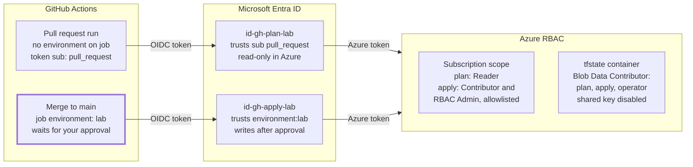

# Azure Terraform Pipeline with GitHub OIDC — Build Guide

Last updated: 2026-09-30 · Updated at the end of every working session; see the Progress log at the end.

## Purpose and how to reuse this guide

This guide builds a secretless Terraform delivery pipeline on Azure: GitHub Actions authenticates with OIDC, state lives in an Entra-only storage account, and plan and apply run as two separate least-privilege managed identities. It is written as a reusable recipe, with the reasoning behind every setting, so the same foundation can be dropped into any new Azure project.

**Reference implementation:** `apim-lab` ([github.com/tleirbakken/apim-lab](https://github.com/tleirbakken/apim-lab)), a home lab for Azure API Management, advanced networking and GitHub Actions. Every code excerpt in this guide comes from that repo. The guide is updated as the project progresses; the Progress log at the end shows how far it has got.

**What you end up with**

- A pull request produces a `terraform plan`, posted as a PR comment, run by a read-only identity.
- A merge to `main` runs `terraform apply` only after a human approves it in a GitHub environment.
- No client secrets, no storage account keys, no SAS tokens. Nothing secret is stored in GitHub.
- Terraform state is versioned and soft-delete protected.
- The pipeline can assign roles to workload identities, but only from an allowlist. It can never make itself Owner.

**How to use it for a new project**

1. Read the Architecture overview and the Security model once. They explain why the pieces fit together.
2. Make the upfront decisions in Prerequisites (repo visibility, region, names).
3. Follow Steps 1 to 9 in order. Each step lists the files, the commands and how to verify it worked.
4. Use the Reuse checklist to see exactly which values change between projects.

**Conventions used here:** Terraform 1.15, azurerm 4.x, Microsoft CAF naming with a `-lab` suffix (swap the suffix per environment). Commands are shown for bash; they work the same in PowerShell unless noted.

## Architecture overview: the trust chain

A workflow never holds a credential: it trades a short-lived GitHub OIDC token for a short-lived Azure token, and which identity it gets depends on how the run was triggered.



Both identities hold roles at both scopes; the right-hand boxes list who has what. The highlighted box (merge to main) is the only path to write access.

**The exchange, step by step**

1. The job requests an OIDC token from GitHub (needs `permissions: id-token: write`). GitHub signs it and sets claims: `iss` = `https://token.actions.githubusercontent.com`, `aud` = `api://AzureADTokenExchange`, and `sub` describing the run.
2. `sub` depends on the trigger: a `pull_request` run gets `repo:<owner>/<repo>:pull_request`; a job with `environment: lab` gets `repo:<owner>/<repo>:environment:lab`, and only after the environment's reviewers approve.
3. The `azure/login` action (or the azurerm provider with `ARM_USE_OIDC=true`) sends the token to Entra ID with the chosen `client_id`.
4. Entra looks for a federated credential on that identity whose issuer, audience and subject all match. No match, no token.
5. Entra returns an Azure access token for the managed identity, valid for about an hour.
6. Azure RBAC decides what that token can do. The plan identity can read; the apply identity can write.

**Where state lives:** one storage account with shared key disabled. Every principal reaches it through Entra ID and a data plane role on the `tfstate` container. Each Terraform layer writes its own blob (`bootstrap.tfstate`, `lab.tfstate`).

## Prerequisites and upfront decisions

Settle these before writing any code; three of them are baked into resource names and federated credential subjects and are painful to change later.

**Tools**

| Tool | Version used | Check with |
| --- | --- | --- |
| Terraform CLI | 1.15.8 | `terraform version` |
| azurerm provider | ~> 4.81 (latest 4.x) | `.terraform.lock.hcl` after `init` |
| random provider | ~> 3.7 | `.terraform.lock.hcl` |
| Azure CLI | any current | `az version` |
| Git + GitHub account | — | `git --version` |

**Azure permissions for the person running bootstrap**

- Owner, or Contributor + User Access Administrator / RBAC Administrator, on the target subscription. Bootstrap creates role assignments, which Contributor alone cannot do.
- That is control plane only. The data plane role on the state container is granted by bootstrap itself (see Step 2, `operator_state`).

**Decisions**

| Decision | apim-lab choice | Why it matters |
| --- | --- | --- |
| Repo visibility | Public | Environment required reviewers are the apply gate. On private repos they need GitHub Enterprise; Free, Pro and Team only get them on public repos. Verify against current [GitHub docs](https://docs.github.com/en/actions/deployment/targeting-different-environments/using-environments-for-deployment). |
| Default branch | `main` | The apply workflow triggers on push to it. Rename before the first push (`git branch -m master main`). |
| Repo owner/name | `tleirbakken/apim-lab` | Part of both OIDC subjects. Renaming the repo breaks login until the credentials are updated. |
| GitHub environment name | `lab` | Part of the apply OIDC subject. |
| Region | `westeurope` | All bootstrap resources. Pick one with capacity for the services you plan to run later. |
| Naming | CAF abbreviations + `-lab` suffix | `rg-`, `st`, `id-` etc. Storage accounts allow no hyphens and max 24 chars. |
| Identity type | User-assigned managed identity | No Entra app registration to manage; lives in Azure RBAC and Terraform. |

**Public repo hygiene:** with a public repo, everything committed is world-readable. That is fine here because the design has no secrets: tenant, subscription and client IDs are identifiers, not credentials. Never commit `.tfstate`, `.tfvars` with secrets or `.env` files.

## Step 1: Repository setup

The repo exists on GitHub, the local clone pushes to `main`, and `.gitignore` keeps state and local overrides out of Git. Status in apim-lab: **done**.

**1.1 Create the GitHub repo** as public (see Prerequisites), without a README, so the first push is clean.

**1.2 Target layout.** Create folders as each step needs them; this is the end state:

```
.github/workflows/   tf-plan.yml (PR), tf-apply.yml (push main, environment "lab")
bootstrap/           run locally once: state storage, UAMIs, federated creds, RBAC
infra/envs/lab/      backend, providers, composition, lab.tfvars
infra/modules/       one module per layer (network, backend, apim, appgw, ...)
docs/                roadmap.md, build-guide.md (this guide), phase-N.md
CLAUDE.md            working agreement for Claude Code
```

Why split `bootstrap/` from `infra/`: bootstrap creates what the pipeline needs to exist, so it cannot run through the pipeline. It runs locally once, as a person. Everything under `infra/` runs only through GitHub Actions.

**1.3 `.gitignore`.** Minimum content:

```
# Terraform
.terraform/
*.tfstate
*.tfstate.*
*.tfplan
crash.log
crash.*.log
override.tf
override.tf.json
*_override.tf
*_override.tf.json

# Claude Code, personal overrides
.claude/settings.local.json

.env
```

Do **not** ignore `.terraform.lock.hcl`. Committing it pins exact provider builds and hashes, so CI installs the same provider you tested locally.

**1.4 Connect the local repo and push.** If the local branch is `master`, rename it first; the apply workflow triggers on `main`.

```bash
git branch -m master main
git remote add origin https://github.com/<owner>/<repo>.git
git push -u origin main
```

**Verify:** `git status -sb` shows `## main...origin/main`, and the repo page on GitHub shows your files.

## Step 2: Bootstrap layer

Seven files in `bootstrap/` create 14 resources: the state storage, two GitHub identities, their OIDC trust and six role assignments. Status in apim-lab: **written, validated, not yet applied**. The repo version carries a comment above every block; the excerpts below are trimmed to the code plus the reasoning.

| File | Creates | Resources |
| --- | --- | --- |
| `versions.tf` | Version pins, provider config | — |
| `variables.tf` | Inputs | — |
| `main.tf` | Suffix, resource group, storage account, container | 4 |
| `identity.tf` | Two UAMIs, two federated credentials | 4 |
| `rbac.tf` | Six role assignments + ABAC condition | 6 |
| `outputs.tf` | Values for GitHub and the backend | — |
| `bootstrap.tfvars` | Subscription ID | — |

### 2.1 versions.tf

```hcl
terraform {
  required_version = "~> 1.15"
  required_providers {
    azurerm = { source = "hashicorp/azurerm", version = "~> 4.81" }
    random  = { source = "hashicorp/random",  version = "~> 3.7" }
  }
}

provider "azurerm" {
  features {}
  subscription_id     = var.subscription_id
  storage_use_azuread = true
}
```

- `~> 4.81` allows 4.81, 4.82 … but never 5.0. Major versions change resource schemas; upgrade deliberately.
- `subscription_id` is mandatory in azurerm 4.x. Passing it as a variable means a run never lands in whatever subscription `az account show` happens to point at.
- `storage_use_azuread = true` is the critical line. Without it, the provider calls `listKeys` to manage the container and blob properties, which fails once shared key is disabled.
- Authentication comes from the Azure CLI session. No credentials in code.

### 2.2 variables.tf

| Variable | Default | Why it is a variable |
| --- | --- | --- |
| `subscription_id` | none (required) | Forces an explicit target. |
| `location` | `westeurope` | Region per project. |
| `github_repo` | `tleirbakken/apim-lab` | Used in both OIDC subjects; a rename is one change. |
| `github_environment` | `lab` | Used in the apply OIDC subject. |
| `assignable_role_ids` | `["4633458b-17de-408a-b874-0445c86b69e6"]` (Key Vault Secrets User) | The allowlist for the apply identity's RBAC condition. Grows as later phases need roles. GUIDs, because the condition matches role definition IDs, not names. |

### 2.3 main.tf — state storage

```hcl
locals {
  tags          = { project = "apim-lab", layer = "bootstrap", managed_by = "terraform" }
  oidc_issuer   = "https://token.actions.githubusercontent.com"
  oidc_audience = "api://AzureADTokenExchange"
}

data "azurerm_client_config" "current" {}
data "azurerm_subscription" "current" {}

resource "random_string" "state_suffix" {
  length  = 6
  lower   = true
  upper   = false
  numeric = true
  special = false
}

resource "azurerm_resource_group" "state" {
  name     = "rg-tfstate-lab"
  location = var.location
  tags     = local.tags
}

resource "azurerm_storage_account" "state" {
  name                            = "sttfstatelab${random_string.state_suffix.result}"
  resource_group_name             = azurerm_resource_group.state.name
  location                        = azurerm_resource_group.state.location
  account_tier                    = "Standard"
  account_replication_type        = "LRS"
  shared_access_key_enabled       = false
  default_to_oauth_authentication = true
  https_traffic_only_enabled      = true
  min_tls_version                 = "TLS1_2"
  allow_nested_items_to_be_public = false

  blob_properties {
    versioning_enabled = true
    delete_retention_policy { days = 30 }
    container_delete_retention_policy { days = 30 }
  }
  tags = local.tags
}

resource "azurerm_storage_container" "tfstate" {
  name                  = "tfstate"
  storage_account_id    = azurerm_storage_account.state.id
  container_access_type = "private"
}
```

(Valid HCL, slightly condensed: object literals and one-argument blocks sit on one line. The repo files use one argument per line.)

| Setting | What it does | Why |
| --- | --- | --- |
| Separate RG `rg-tfstate-lab` | Holds state + identities | Bootstrap outlives the lab; deleting lab RGs must not delete state or pipeline identities. |
| `random_string` suffix | 6 lowercase chars/digits | Storage names are globally unique. The value is stored in state, so it never changes on later runs. |
| `shared_access_key_enabled = false` | Disables account keys and SAS | Only Entra ID + RBAC can reach data. This is what makes the design secretless. |
| `default_to_oauth_authentication` | Portal uses Entra when browsing blobs | There are no keys for the portal to fall back on. |
| `min_tls_version`, `https_traffic_only_enabled` | TLS 1.2, HTTPS only | Baseline transport security. |
| `allow_nested_items_to_be_public = false` | No container can go anonymous | State can contain sensitive values. |
| Versioning | Every write keeps the previous version | Roll back a corrupt or bad state file. |
| Blob + container soft delete, 30 days | Deleted items recoverable | Protects against `az storage blob delete` mistakes. |
| `LRS` | Single-region replication | Enough for a lab; versioning covers logical mistakes. Use ZRS/GRS in production. |
| Public network access left on | Reachable from the internet (auth still required) | GitHub-hosted runners have no fixed IPs. Deliberate lab exception; production would use a self-hosted runner in the VNet + private endpoint. |
| `storage_account_id` on the container | Creates the container through ARM | Makes `.id` an ARM resource ID, which RBAC scopes need. `storage_account_name` is deprecated in 4.x. |

### 2.4 identity.tf — identities and OIDC trust

```hcl
resource "azurerm_user_assigned_identity" "plan" {
  name                = "id-gh-plan-lab"
  resource_group_name = azurerm_resource_group.state.name
  location            = azurerm_resource_group.state.location
  tags                = local.tags
}
# "apply" is identical with name = "id-gh-apply-lab"

resource "azurerm_federated_identity_credential" "plan" {
  name                      = "gh-pull-request"
  user_assigned_identity_id = azurerm_user_assigned_identity.plan.id
  issuer                    = local.oidc_issuer
  audience                  = [local.oidc_audience]
  subject                   = "repo:${var.github_repo}:pull_request"
}

resource "azurerm_federated_identity_credential" "apply" {
  name                      = "gh-environment-${var.github_environment}"
  user_assigned_identity_id = azurerm_user_assigned_identity.apply.id
  issuer                    = local.oidc_issuer
  audience                  = [local.oidc_audience]
  subject                   = "repo:${var.github_repo}:environment:${var.github_environment}"
}
```

- **Two identities, not one.** PR code runs before anyone reviews it. If the PR identity could write, any PR could change infrastructure. Splitting makes the PR path read-only by construction.
- **Issuer + audience + subject must all match** the claims in GitHub's token exactly, or Entra refuses the exchange (error `AADSTS70021: No matching federated identity record found`).
- **Plan subject `repo:<owner>/<repo>:pull_request`** is what GitHub puts in `sub` for any `pull_request`-triggered run. Every PR matches, which is why the identity is read-only. On public repos, PRs from forks do not get an OIDC token by default.
- **Apply subject `repo:<owner>/<repo>:environment:lab`** is what GitHub puts in `sub` for any job with `environment: lab`, regardless of branch. So the branch is not the gate; the environment's required reviewers are.
- azurerm 4.x uses `user_assigned_identity_id`. Older examples online use `parent_id`.

### 2.5 rbac.tf — permissions

The full role matrix and the ABAC condition are explained in the Security model section. The pattern for every assignment:

```hcl
resource "azurerm_role_assignment" "plan_state" {
  scope                = azurerm_storage_container.tfstate.id
  role_definition_name = "Storage Blob Data Contributor"
  principal_id         = azurerm_user_assigned_identity.plan.principal_id
  principal_type       = "ServicePrincipal"
}
```

- `principal_id` (object ID) is used for RBAC. `client_id` (application ID) is used for login. Mixing them up is a common error.
- `principal_type` is set on every assignment. A freshly created identity can take a while to replicate in Entra; with `principal_type` set, ARM skips the lookup and the assignment does not fail with `PrincipalNotFound`.
- The operator's own assignment uses `data.azurerm_client_config.current.object_id` with `principal_type = "User"`. If you run bootstrap as a service principal instead, change it to `ServicePrincipal`.

### 2.6 outputs.tf

| Output | Used as | Note |
| --- | --- | --- |
| `tenant_id` | GitHub variable `AZURE_TENANT_ID` | |
| `subscription_id` | GitHub variable `AZURE_SUBSCRIPTION_ID` | |
| `client_id_plan` | GitHub variable `AZURE_CLIENT_ID_PLAN` | `client_id`, not `principal_id` |
| `client_id_apply` | GitHub variable `AZURE_CLIENT_ID_APPLY` | |
| `state_resource_group_name` | `backend` block `resource_group_name` | |
| `state_storage_account_name` | `backend` block `storage_account_name` | Contains the random suffix |
| `state_container_name` | `backend` block `container_name` | |

These IDs go into GitHub as *variables*, not secrets. They are identifiers; without a matching federated credential a client ID grants nothing, and visible values make workflow logs debuggable.

### 2.7 bootstrap.tfvars

```hcl
subscription_id = "<your subscription id>"
```

Committed on purpose: a subscription ID is not a secret. Never put credentials in it.

### Verify

```bash
terraform -chdir=bootstrap fmt -check
terraform -chdir=bootstrap init
terraform -chdir=bootstrap validate
az login
terraform -chdir=bootstrap plan -var-file=bootstrap.tfvars   # expect: 14 to add
```

## Step 3: Run bootstrap and migrate its state

Bootstrap runs once with local state, then moves its own state into the container it just created, so no state file stays on a laptop. Status in apim-lab: **next up**. This section will be refined with real output once it has been run.

**3.1 Apply locally.** Fill in `bootstrap.tfvars`, then:

```bash
az login
az account set --subscription <subscription-id>
terraform -chdir=bootstrap plan -var-file=bootstrap.tfvars -out=bootstrap.tfplan
terraform -chdir=bootstrap apply bootstrap.tfplan
terraform -chdir=bootstrap output
```

Applying a saved plan file guarantees that what runs is exactly what you reviewed. `*.tfplan` is gitignored.

**3.2 Wait for RBAC.** Role assignments can take a few minutes to take effect. If the next step fails with `403 AuthorizationPermissionMismatch`, wait and retry; do not add keys.

**3.3 Add a backend block** as `bootstrap/backend.tf`, using the values from `terraform output`:

```hcl
terraform {
  backend "azurerm" {
    resource_group_name  = "rg-tfstate-lab"
    storage_account_name = "sttfstatelab<suffix>"
    container_name       = "tfstate"
    key                  = "bootstrap.tfstate"
    use_azuread_auth     = true
  }
}
```

- `use_azuread_auth = true` makes the backend use Entra ID for blob access. Without it the backend tries keys and fails.
- Backend blocks cannot use variables, so the values are literal. They are not secret.
- `key` is the blob name. Each layer gets its own key (`bootstrap.tfstate`, `lab.tfstate`), so layers never share or lock each other's state.

**3.4 Migrate.**

```bash
terraform -chdir=bootstrap init -migrate-state
```

Answer `yes` when asked to copy the existing state. This works because bootstrap granted *you* Storage Blob Data Contributor on the container (`operator_state`); Owner on the subscription alone gives no blob data access.

**3.5 Clean up and verify.**

- `terraform -chdir=bootstrap plan -var-file=bootstrap.tfvars` shows **No changes**, now reading remote state.
- The blob `bootstrap.tfstate` exists in the container (check in the portal, which uses Entra auth).
- Delete the local `bootstrap/terraform.tfstate` and `terraform.tfstate.backup` once remote state is confirmed. Do not open or print them; they can contain sensitive values.
- `az storage account show -n <name> --query allowSharedKeyAccess` returns `false`.

**Chicken-and-egg note:** if you ever destroy bootstrap, first migrate its state back to local (`terraform init -migrate-state` after removing `backend.tf`), because destroy deletes the container holding its own state.

## Steps 4–9: GitHub wiring and the pipeline

These steps turn the bootstrap outputs into a working plan-on-PR, apply-on-merge pipeline. Status in apim-lab: **not started**. Each step is sketched with what is known now and will be expanded with the real files, output and pitfalls as we build it.

### Step 4: Repo variables

GitHub → repo → Settings → Secrets and variables → Actions → **Variables** tab (not Secrets):

| Variable | Value from |
| --- | --- |
| `AZURE_TENANT_ID` | `terraform output tenant_id` |
| `AZURE_SUBSCRIPTION_ID` | `terraform output subscription_id` |
| `AZURE_CLIENT_ID_PLAN` | `terraform output client_id_plan` |
| `AZURE_CLIENT_ID_APPLY` | `terraform output client_id_apply` |

Or with the GitHub CLI: `gh variable set AZURE_TENANT_ID --body "<value>"`.

### Step 5: Environment `lab` with required reviewers

Settings → Environments → New environment `lab` → Required reviewers: yourself. Optionally restrict deployment branches to `main`. The name must match `github_environment` in bootstrap exactly, or the apply login fails.

### Step 6: `infra/envs/lab` with one trivial resource

A single resource group proves the whole chain before real infrastructure is added. Known requirements:

- Its own `backend "azurerm"` block with `key = "lab.tfstate"`, `use_azuread_auth = true` and `use_oidc = true`.
- Provider `resource_provider_registrations = "none"`. Otherwise the plan identity (Reader) fails trying to register resource providers, which is a write.

### Step 7: `tf-plan.yml` (pull requests)

Key elements, to be written out in full when built:

- `on: pull_request` targeting `main`.
- `permissions: id-token: write` (OIDC), `contents: read`, `pull-requests: write` (plan comment).
- Env: `ARM_CLIENT_ID` = `vars.AZURE_CLIENT_ID_PLAN`, `ARM_TENANT_ID`, `ARM_SUBSCRIPTION_ID`, `ARM_USE_OIDC=true`.
- Steps: checkout → setup Terraform (pinned version) → `fmt -check` → `init` → `validate` → `plan -no-color` → post plan as PR comment.
- **No** `environment:` on this job, so its token subject stays `pull_request`.

### Step 8: `tf-apply.yml` (merge to main)

- `on: push` to `main`.
- `environment: lab` on the job: this pauses for approval and sets the token subject that matches the apply identity.
- Env: `ARM_CLIENT_ID` = `vars.AZURE_CLIENT_ID_APPLY`, plus the same tenant/subscription/OIDC variables.
- Steps: checkout → setup Terraform → `init` → `apply -auto-approve`.
- Known trade-off: apply re-plans, so it can differ from the plan shown on the PR if something changed in between. Acceptable in a lab and documented; the stricter alternative is passing the plan file as an artifact.

### Step 9: Phase documentation

`docs/phase-1.md` explains the trust chain from GitHub token to Azure role, with file and line references.

### Phase 1 is done when

- [ ] A PR gets a plan comment, run as `id-gh-plan-lab`
- [ ] A merge waits for approval and applies as `id-gh-apply-lab`
- [ ] No secrets in the repo, no access keys enabled on the state account
- [ ] `docs/phase-1.md` explains the trust chain

## Security model and RBAC reference

Three principals touch the platform, each with the smallest set of roles that lets it do its job; no principal holds Owner, and nothing uses a key.

### Role matrix

| Principal | Role | Scope | Why |
| --- | --- | --- | --- |
| `id-gh-plan-lab` | Reader | Subscription | `plan` reads every resource it compares against. No write actions, so unreviewed PR code cannot change anything. |
| `id-gh-plan-lab` | Storage Blob Data Contributor | `tfstate` container | Reads state and takes the lock. The lock is a blob lease, which is a write, so Reader-level data access is not enough. |
| `id-gh-apply-lab` | Contributor | Subscription | Creates, changes and deletes resources. Cannot assign roles. |
| `id-gh-apply-lab` | Storage Blob Data Contributor | `tfstate` container | Contributor is control plane only and has no data actions, so it cannot read or write state blobs without this. |
| `id-gh-apply-lab` | Role Based Access Control Administrator + condition | Subscription | Lets later phases grant workload identities their roles (APIM managed identity → Key Vault), limited to an allowlist. |
| Operator (you) | Storage Blob Data Contributor | `tfstate` container | Needed for `init -migrate-state`. With keys disabled, even Owner has no blob data access. |

**Why container scope for state:** least privilege. The identities can reach this one container, not other containers or other storage accounts.

**Why subscription scope for Reader/Contributor:** later phases create resource groups, which requires subscription scope. For a tighter setup, pre-create the resource groups in bootstrap and scope Contributor to each.

### The ABAC condition on RBAC Administrator

RBAC Administrator on its own can assign *any* role, including Owner. The pipeline could therefore make itself Owner. The condition closes that door:

```
(
 (
  !(ActionMatches{'Microsoft.Authorization/roleAssignments/write'})
 )
 OR
 (
  @Request[Microsoft.Authorization/roleAssignments:RoleDefinitionId] ForAnyOfAnyValues:GuidEquals {<allowed role GUIDs>}
 )
)
AND
(
 (
  !(ActionMatches{'Microsoft.Authorization/roleAssignments/delete'})
 )
 OR
 (
  @Resource[Microsoft.Authorization/roleAssignments:RoleDefinitionId] ForAnyOfAnyValues:GuidEquals {<allowed role GUIDs>}
 )
)
```

Read each half as: "either this is not the action I restrict, OR the role involved is on the allowlist."

| Half | Applies to | Checks | Effect |
| --- | --- | --- | --- |
| 1 | Creating an assignment (`write`) | `@Request` = the role being requested | Only allowlisted roles can be granted. |
| 2 | Removing an assignment (`delete`) | `@Resource` = the role on the existing assignment | The pipeline cannot remove assignments outside the allowlist, such as your Owner. |

Owner, User Access Administrator and RBAC Administrator are never on the list, so they are denied implicitly. The condition uses `condition_version = "2.0"`.

**Growing the allowlist:** add the role's GUID to `assignable_role_ids` in bootstrap and re-apply bootstrap locally. The pipeline cannot widen its own allowlist, because changing its own role assignment is outside the allowlist too. Find GUIDs with `az role definition list --name "<role name>" --query "[].name" -o tsv`.

Common additions later in apim-lab (verify the GUID with the command above before adding):

| Role | Typical use |
| --- | --- |
| Key Vault Secrets User | APIM named values, App Gateway TLS certificate, app secrets (already allowed) |
| AcrPull | Container App pulling from a registry |

### Threat check

| If an attacker... | They get | Because |
| --- | --- | --- |
| Opens a PR with malicious workflow code | Read access to the subscription + state | Plan identity is read-only. Fork PRs get no OIDC token by default. |
| Pushes to `main` | A pending apply that waits for your approval | Apply token is only issued to jobs in the `lab` environment. |
| Reads the public repo | Tenant, subscription and client IDs | Identifiers only; no credential exists to steal. |
| Compromises the apply run after approval | Contributor + allowlisted role grants | Cannot become Owner or grant itself more roles. |

## Gotchas and troubleshooting

Most failures in this setup come from four things: a missing `id-token` permission, a subject that does not match, missing data plane roles, and RBAC propagation delay.

| Symptom | Likely cause | Fix |
| --- | --- | --- |
| Workflow login fails with a vague OIDC or "unable to get ACTIONS_ID_TOKEN_REQUEST_URL" error | Workflow lacks `permissions: id-token: write` | Add it at workflow or job level. |
| `AADSTS70021: No matching federated identity record found` | Token `sub` does not match the credential's subject | Compare repo owner/name (case), environment name, and whether the job has `environment:`. A plan job with `environment:` gets the environment subject, not `pull_request`. |
| `403 AuthorizationPermissionMismatch` on state | Principal has control plane roles only | Grant Storage Blob Data Contributor on the container. Owner/Contributor do not include data actions. |
| 403 right after bootstrap apply | RBAC has not propagated yet | Wait a few minutes and retry. |
| Provider errors calling `listKeys` | Shared key disabled but provider not told | `storage_use_azuread = true` in the provider; `use_azuread_auth = true` in the backend. |
| `PrincipalNotFound` when assigning a role to a new identity | Entra replication delay | Set `principal_type` on the role assignment. |
| Plan identity fails registering resource providers | azurerm registers providers by default, which is a write | `resource_provider_registrations = "none"` in the provider for pipeline-run layers. |
| `StorageAccountAlreadyTaken` | Storage names are globally unique | That is what the random suffix is for. |
| Apply job runs without waiting for approval | Environment has no required reviewers, or the job lacks `environment:` | Configure reviewers; check the job definition. |
| Required reviewers option missing | Private repo on Free/Pro/Team | Make the repo public, or use Enterprise. |
| Apply result differs from the PR's plan | Apply re-plans against current state | Accept and document in a lab, or pass the plan file between workflows as an artifact. |

**Rules that prevent most of these**

- Never commit or print `.tfstate` files. They can hold secrets in plain text.
- Never "fix" a 403 by enabling shared key access. Grant the data role instead.
- Never give the pipeline Owner. If it needs to grant a role, add that role to the allowlist.

**Later-phase gotchas already known for apim-lab**

- APIM classic internal VNet injection requires Developer or Premium tier. v2 tiers differ: Standard v2 has outbound VNet integration + inbound private endpoint; Premium v2 has injection. Check current docs.
- APIM Developer takes 30–45 minutes to deploy; do not tear it down routinely.
- APIM is soft-deleted on destroy; reusing the name requires a purge.
- Internal mode NSG needs inbound `ApiManagement` service tag on 3443 and `AzureLoadBalancer` on 6390.
- A private-endpoint-only state account blocks GitHub-hosted runners: use a self-hosted runner in the VNet or document the exception.
- App Gateway WAF v2 and APIM drive cost: keep a destroy workflow for App Gateway.

## Version notes

The guide targets Terraform 1.15 and azurerm 4.x. azurerm 5.x was already out when this was written (5.7.0 released 24 Sep 2026), so check versions before starting a new project.

| Item | State when written | Impact |
| --- | --- | --- |
| Terraform CLI | 1.15.8 | `required_version = "~> 1.15"`; pin the same version in CI. |
| azurerm | Latest 4.x: 4.81.0. Latest 5.x: 5.7.0 | Stay on `~> 4.81` until the [5.0 upgrade guide](https://registry.terraform.io/providers/hashicorp/azurerm/latest/docs/guides/5.0-upgrade-guide) has been read and the change is a deliberate decision. |
| `azurerm_federated_identity_credential` | Parent argument is `user_assigned_identity_id` | Older examples use `parent_id`. |
| `azurerm_storage_container` | `storage_account_id` | `storage_account_name` is deprecated. Using the ID also makes the container's `.id` an ARM ID usable as an RBAC scope. |
| azurerm 4.x provider block | `subscription_id` is required | Set it explicitly (variable or `ARM_SUBSCRIPTION_ID`). |
| azurerm 4.x resource provider registration | Registers a default set automatically | Set `resource_provider_registrations = "none"` where the running identity cannot register providers. |

**How to check current versions**

```bash
# latest azurerm tags
git ls-remote --tags https://github.com/hashicorp/terraform-provider-azurerm.git 'refs/tags/v4.*' | tail -3
# what a project actually uses
grep -A1 'hashicorp/azurerm' .terraform.lock.hcl
```

For argument names, read the docs for the exact version you pin: `https://raw.githubusercontent.com/hashicorp/terraform-provider-azurerm/v<version>/website/docs/r/<resource>.html.markdown`.

## Reuse checklist for a new project

Copying this foundation into a new repo means changing seven values and re-checking versions; everything else carries over unchanged.

**Copy**

- [ ] `bootstrap/` (all seven files)
- [ ] `.gitignore`
- [ ] Later: `.github/workflows/tf-plan.yml` and `tf-apply.yml`

**Change**

| Where | Value | apim-lab | New project |
| --- | --- | --- | --- |
| `variables.tf` | `github_repo` default | `tleirbakken/apim-lab` | `<owner>/<repo>` |
| `variables.tf` | `github_environment` default | `lab` | e.g. `dev`, `prod` |
| `variables.tf` | `location` default | `westeurope` | your region |
| `variables.tf` | `assignable_role_ids` | Key Vault Secrets User | roles the project's workloads need |
| `main.tf` | `local.tags.project` | `apim-lab` | project name |
| `main.tf`, `identity.tf` | `-lab` suffix in names | `rg-tfstate-lab`, `id-gh-plan-lab` … | environment suffix |
| `bootstrap.tfvars` | `subscription_id` | lab subscription | target subscription |

**Re-check**

- [ ] Latest Terraform and azurerm versions (Version notes)
- [ ] Repo visibility vs GitHub plan for environment reviewers
- [ ] Region capacity for the services you will deploy

**Multiple environments** (dev/test/prod): run bootstrap once per environment with its own suffix and environment name, or extend it with `for_each` over a map of environments so each gets its own pair of identities and its own state key. One state account can serve all environments as long as each layer and environment uses a distinct `key`.

## Progress log (apim-lab)

Phase 1, step 2 of 9: bootstrap is written and validated; next is running it and migrating its state.

| Date | What | Notes |
| --- | --- | --- |
| 2026-09-30 | Build guide moved into the repo as `docs/build-guide.md` | Updated at the end of every session (rule in `CLAUDE.md`). |
| 2026-09-30 | Bootstrap files commented block by block | Comments say what each block does and why; fmt and validate still pass. |
| 2026-09-30 | Roadmap design table corrected | Apply identity needs Storage Blob Data Contributor on state; operator needs it for `-migrate-state`; azurerm 5.x noted. |
| 2026-09-30 | `bootstrap/` written (7 files, 14 resources) | azurerm pinned `~> 4.81` after finding 5.x released; `fmt -check`, `init`, `validate` pass. Not yet applied. |
| 2026-09-30 | Local repo pushed to GitHub | Branch renamed `master` → `main`; remote added. |
| 2026-09-30 | GitHub repo created, public | Public so environment required reviewers work on a non-Enterprise plan. |
| 2026-09-30 | Project scaffold | `CLAUDE.md` (working agreement), `docs/roadmap.md` (6 phases), `.gitignore`. |

**Roadmap beyond phase 1:** 2 Network (hub/spoke, NSGs, subnets) → 3 Private backend (Function/Container App + Key Vault behind private endpoints) → 4 APIM internal + App Gateway WAF → 5 APIM config as code (APIOps) → 6 Second tenant (DNS Private Resolver, cross-tenant Private Link). Sections will be added to this guide as each phase is built.
